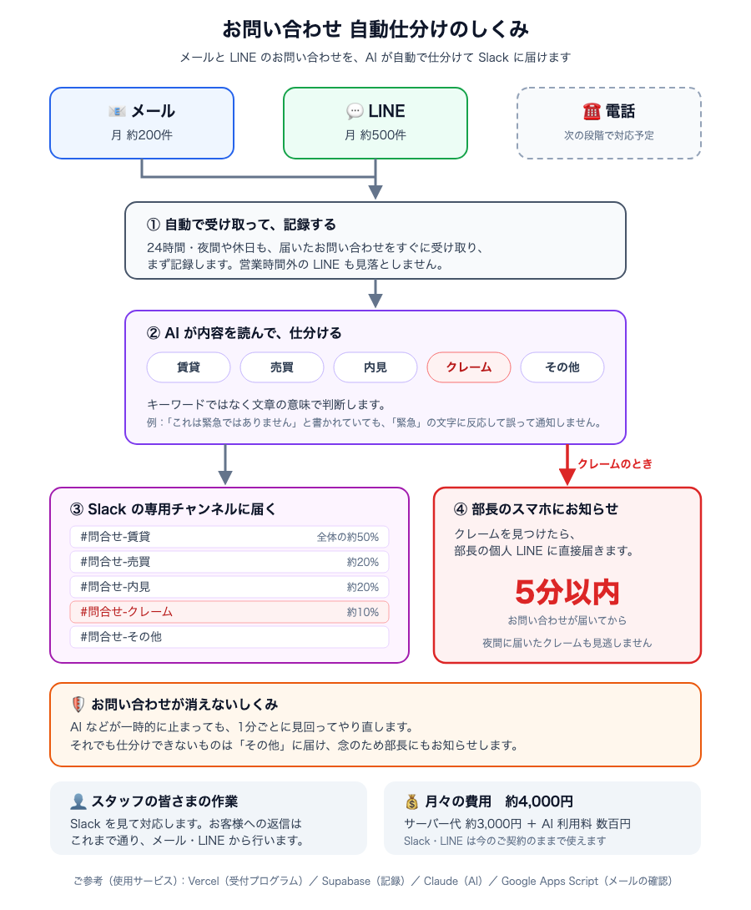

# 問い合わせ自動仕分け・緊急通知システム — 不動産管理会社想定（模擬案件）

不動産管理会社の営業部長からの依頼「物件の問い合わせがメール・LINE・電話とバラバラで管理が大変。全部 Slack に集約して自動で振り分けてほしい。クレームなど緊急のものは LINE で個別に通知してほしい」を起点とした模擬案件です。AIエンジニア講座の一環として、リスク洗い出し〜ヒアリング〜提案〜5営業日での実装〜本番デプロイまでを一通り作成しました。

**本番URL**: https://inquiry-router.vercel.app （API のみ。画面はありません）



## この案件でやったこと

- 外部API（LINE / Slack / Gmail / Claude）を組み合わせる案件として、着手前に**技術・ビジネス・運用の3観点でリスクを洗い出し**、影響度×発生確率で評価した。依頼内容を受けて「送信型」の仮定から「受信を集約する型」に全面的に作り直した（[`リスク一覧.md`](./リスク一覧.md)）
- 予算5〜20万円の制約から、3つの軸（チャネル統合・AI分類・緊急通知）のうち**電話を Phase2 に回し**、代わりに見本にはなかった「取りこぼし防止（まず保存 → 失敗したら再処理 → 分類できなくても必ず人に渡す）」を MVP に入れた（[`スコープ.md`](./スコープ.md)、[`提案書.md`](./提案書.md)）
- 常時稼働のサーバーを持たない構成（Webhook ＋ Vercel Functions ＋ Supabase pg_cron）で、**月額約4,000円**の見込み
- **緊急ルートを通常ルートから分離**：キーワードで緊急の可能性があるものは、受信した関数の中で `after()` を使って即処理し、それ以外はキュー（1分ごとの Cron）で処理する。最終的な緊急判定は必ず Claude が行う（「緊急ではありません」に反応しない）。**実機の LINE で、受信から部長の LINE まで 5.9秒**（SLA 5分）
- 外部API案件の3つの落とし穴に対応した
  - **署名検証**：LINE の HMAC 検証。GAS からのメールはタイムスタンプ付き HMAC 署名で、再送攻撃も拒否する
  - **レート制限**：429 は失敗として記録し、Cron が再試行する
  - **冪等性**（何度実行しても結果が同じになること）：一意制約、`FOR UPDATE SKIP LOCKED` による確保、手順ごとの完了記録、LINE の `X-Line-Retry-Key`
- **Headless モード（`claude -p`）を QA 担当・運用担当として使った**：サンプル22件の精度検証では、合格基準の外にあった誤検知（「明日の内見」を緊急と判定）を指摘させ、プロンプトを修正して 22/22 にした。運用チェックでは、止まっている問い合わせ・通知漏れ・SLA 違反を点検し、非エンジニア向けのレポートを出す
- 開発中に、Supabase の URL のパスが二重になる問題、GAS の秘密鍵の貼り間違い（指紋で比べて特定）などを切り分けて修正した

## 技術スタック

Next.js 16（App Router, Route Handlers, `after()`）／Vercel／Supabase（Postgres, pg_cron, pg_net, Vault、東京リージョン）／Claude API（`claude-haiku-4-5`、tool_choice による構造化出力）／LINE Messaging API／Slack Web API／Google Apps Script

## ドキュメント

| ドキュメント | 内容 |
|---|---|
| [提案書.md](./提案書.md)（[PDF](./提案書.pdf)） | A4・1枚の提案書（課題・MVP・効果・費用・ご了承いただきたい点） |
| [Phase2提案書.md](./Phase2提案書.md)（[PDF](./Phase2提案書.pdf)） | 納品時の継続提案（電話の自動受付＋テキスト化）。MVPの実績報告つき、A4・1枚 |
| [ヒアリングシート.md](./ヒアリングシート.md) | 依頼文の分析、ヒアリング項目と回答 |
| [スコープ.md](./スコープ.md) | MVP / Phase2 の切り分けと5日間の計画・合格基準 |
| [リスク一覧.md](./リスク一覧.md) | 技術・ビジネス・運用のリスクと、実装した対策・検証結果 |
| [docs/architecture.png](./docs/architecture.png) | 構成図（技術版） |
| [引き継ぎ資料.md](./引き継ぎ資料.md)（[PDF](./引き継ぎ資料.pdf)） | クライアント（営業部長・スタッフ）向け、A4・1枚の引き継ぎ資料 |
| [docs/運用マニュアル.md](./docs/運用マニュアル.md) | スタッフ向け：Slack の見方、未分類が届いたときの対応 |
| [docs/開発者向け引き継ぎ.md](./docs/開発者向け引き継ぎ.md) | 構成・設計上の約束ごと・監視ビュー・よくある作業 |
| [docs/APIキー再発行・障害対応手順書.md](./docs/APIキー再発行・障害対応手順書.md) | 全キーの再発行手順、症状別の障害対応、手動での再処理 |
| [docs/受け入れテスト結果.md](./docs/受け入れテスト結果.md) | 5カテゴリのチャンネル振り分けと、クレーム10件の緊急通知SLA（10/10） |
| [納品チェックリスト.md](./納品チェックリスト.md) | 納品物チェックリスト8項目と、それぞれの根拠 |
| [docs/アカウント準備手順.md](./docs/アカウント準備手順.md) / [docs/フェーズ2_設定手順.md](./docs/フェーズ2_設定手順.md) | LINE・Slack・Supabase・GAS の初期設定 |

## システム構成

```
LINE ──Webhook──→ /api/line/webhook ─┐  署名検証 → まず保存 → キーワードでルート判定
Gmail ─GAS(1分)─→ /api/mail/ingest ──┤
                                     ├─ 緊急 → after() で即処理 ──────────┐
                                     └─ 通常 → pg_cron(1分) → /api/cron ──┤
                                                                         ▼
                              確保 → Claude で分類 → Slack 5チャンネル → クレームなら部長 LINE
```

## セットアップ

1. `npm install`
2. `.env.example` を `.env.local` にコピーし、[docs/アカウント準備手順.md](./docs/アカウント準備手順.md) に沿って各サービスの値を設定する
3. Supabase の SQL Editor で `supabase/schema.sql` を実行する
4. `npm run check:connections` で全サービスへの接続を確認する
5. Vercel にデプロイし、[docs/フェーズ2_設定手順.md](./docs/フェーズ2_設定手順.md) に沿って LINE の Webhook URL と GAS を設定する
6. `supabase/cron.sql` の `__CRON_SECRET__` を置き換えて SQL Editor で実行する（毎分のキュー処理）
7. `supabase/dashboard.sql` を SQL Editor で実行する（監視ビュー）

## テスト・動作確認

| コマンド | 内容 |
|---|---|
| `npm run classify:sample -- --all` | サンプル22件の分類精度（既定は3件だけ） |
| `npm run eval:headless` | Headless モードで22件を検証し、合否判定と改善案を出す |
| `npm run test:webhooks [URL]` | 署名検証・保存・重複防止・ルート判定（10項目） |
| `npx tsx scripts/test-processing.ts` | 分類 → Slack → LINE、再処理で二重投稿しない、分類失敗時の未分類通知（7項目） |
| `npm run test:urgent [URL]` | 同時確保の排他、緊急ルートの即時処理と SLA、通常ルートとの分離（5項目） |
| `npm run check:cron` | pg_cron による自動処理 |
| `npm run ops:check` | Headless モードによる運用チェック |
| `npm run test:acceptance` | 受け入れテスト（5カテゴリの振り分け＋クレーム10件のSLA） |
